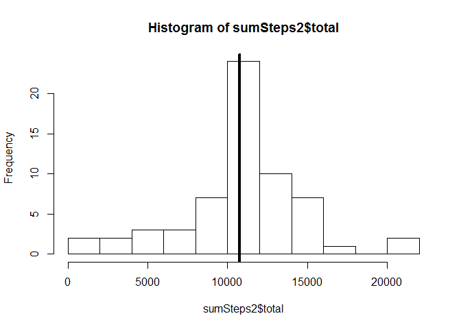
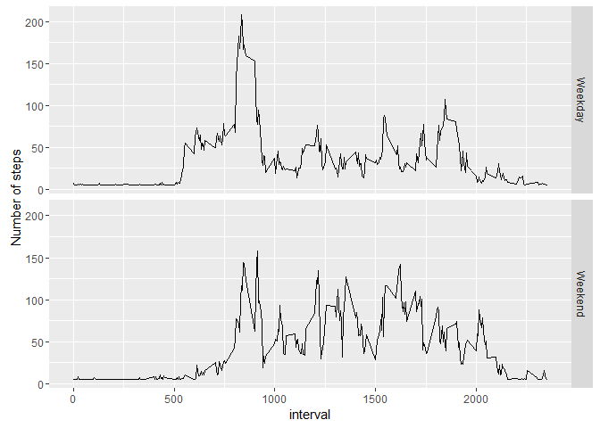

# PA1_template
idow  
February 2, 2016  

Loading and preprocessing the data:


```r
library(dplyr)
```

```
## Warning: package 'dplyr' was built under R version 3.2.3
```

```
## 
## Attaching package: 'dplyr'
```

```
## The following objects are masked from 'package:stats':
## 
##     filter, lag
```

```
## The following objects are masked from 'package:base':
## 
##     intersect, setdiff, setequal, union
```

```r
library(ggplot2)
```

```
## Warning: package 'ggplot2' was built under R version 3.2.3
```

```r
AMD <- read.csv("activity.csv")
```

Calculate the total number of steps taken per day
Make a histogram of the total number of steps taken each day

```r
sumSteps <- AMD %>% group_by(date) %>% summarize(total = sum(steps, na.rm = TRUE), 
                                                 avg = mean(steps, na.rm = TRUE),
                                                 median = median(steps, na.rm = TRUE))
hist(sumSteps$total, breaks = 10)
```


Calculate and report the mean and median of the total number of steps taken per day


```r
paste("The mean number of steps per day is", round(mean(sumSteps$total),3), sep = " ")
```

```
## [1] "The mean number of steps per day is 9354.23"
```

```r
paste("The median number of steps per day is", round(median(sumSteps$total),3), sep = " ")
```

```
## [1] "The median number of steps per day is 10395"
```

Make a time series plot (i.e. type = "l") of the 5-minute interval (x-axis) and the average number of steps taken, averaged across all days (y-axis)
Which 5-minute interval, on average across all the days in the dataset, contains the maximum number of steps?


```r
sumInt <- AMD %>% group_by(interval) %>% summarize(avg = mean(steps, na.rm = TRUE))
plot(sumInt$interval, sumInt$avg, type = "l")
```


```r
paste("The interval with the maximum number of steps is", 
      sumInt[sumInt$avg == max(sumInt$avg, na.rm = TRUE),][1], sep = " ")
```

```
## [1] "The interval with the maximum number of steps is 835"
```

Calculate and report the total number of missing values in the dataset (i.e. the total number of rows with NAs)


```r
table(complete.cases(AMD))
```

```
## 
## FALSE  TRUE 
##  2304 15264
```

We can see that 2304 rows are not "complete cases", hence they include NA. 

Devise a strategy for filling in all of the missing values in the dataset. 

**The NA values will be replaced with the average number of steps:**

Create a new dataset that is equal to the original dataset but with the missing data filled in.


```r
AMD2 <- AMD
AMD2$steps[is.na(AMD2$steps)] <- mean(AMD2$steps, na.rm = TRUE)
```

now we can make sure that we don't have any NA:


```r
table(complete.cases(AMD2))
```

```
## 
##  TRUE 
## 17568
```

Make a histogram of the total number of steps taken each day and Calculate and report the mean and median total number of steps taken per day. Do these values differ from the estimates from the first part of the assignment? What is the impact of imputing missing data on the estimates of the total daily number of steps?


```r
sumInt2 <- AMD2 %>% group_by(date) %>% summarize(sum = sum(steps, na.rm = TRUE))

sumSteps2 <- AMD2 %>% group_by(date) %>% summarize(total = sum(steps, na.rm = TRUE), 
                                                 avg = mean(steps, na.rm = TRUE),
                                                 median = median(steps, na.rm = TRUE))
hist(sumSteps2$total, breaks = 10)
abline(v=mean(sumSteps2$total), lwd = 4)
```



```r
paste("The mean number of steps per day is", round(mean(sumSteps2$total),3), sep = " ")
```

```
## [1] "The mean number of steps per day is 10766.189"
```

```r
paste("The median number of steps per day is", round(median(sumSteps2$total),3), sep = " ")
```

```
## [1] "The median number of steps per day is 10766.189"
```

```r
paste("The difference between the mean number of steps after replacing the NA is",
      round(mean(sumSteps2$total) - mean(sumSteps$total ),3), sep = " " )
```

```
## [1] "The difference between the mean number of steps after replacing the NA is 1411.959"
```

```r
paste("The difference between the median number of steps after replacing the NA is",
      round(median(sumSteps2$total) - median(sumSteps$total ),3), sep = " " )
```

```
## [1] "The difference between the median number of steps after replacing the NA is 371.189"
```

Create a new factor variable in the dataset with two levels - "weekday" and "weekend" indicating whether a given date is a weekday or weekend day.


```r
AMD2$weekday <- weekdays(as.Date(AMD2$date))
AMD2$weekday[which(AMD2$weekday[] == "Saturday" | AMD2$weekday[] == "Sunday")] <- "Weekend"
AMD2$weekday[which(AMD2$weekday[] != "Weekend")] <- "Weekday"
```

Make a panel plot containing a time series plot (i.e. type = "l") of the 5-minute interval (x-axis) and the average number of steps taken, averaged across all weekday days or weekend days (y-axis).


```r
sumInt2 <- AMD2 %>% group_by(interval, weekday) %>% summarize(avg = mean(steps, na.rm = TRUE))
qplot(interval, avg, data = sumInt2, facets = weekday ~ ., geom = "line", ylab = "Number of steps")
```




