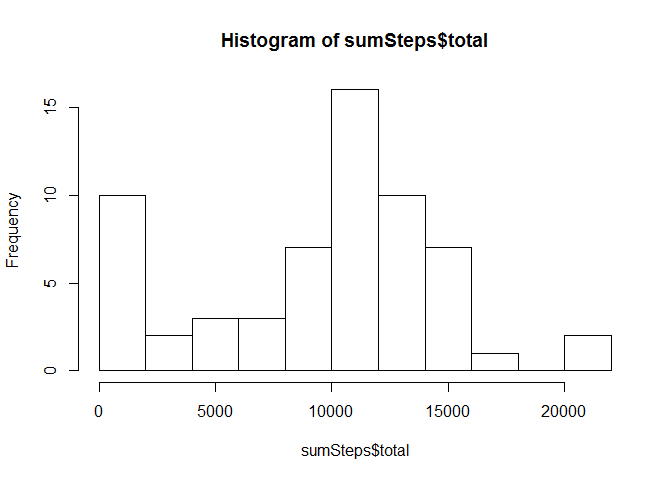
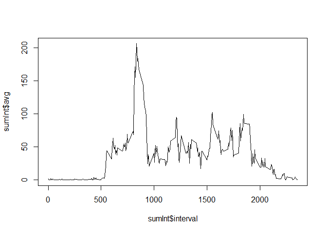

# PA1_template
idow  
February 2, 2016  

Loading and preprocessing the data:


```r
library(dplyr)
```

```
## Warning: package 'dplyr' was built under R version 3.2.3
```

```
## 
## Attaching package: 'dplyr'
```

```
## The following objects are masked from 'package:stats':
## 
##     filter, lag
```

```
## The following objects are masked from 'package:base':
## 
##     intersect, setdiff, setequal, union
```

```r
library(ggplot2)
```

```
## Warning: package 'ggplot2' was built under R version 3.2.3
```

```r
AMD <- read.csv("activity.csv")
```

Calculate the total number of steps taken per day
Make a histogram of the total number of steps taken each day
Calculate and report the mean and median of the total number of steps taken per day


```r
sumSteps <- AMD %>% group_by(date) %>% summarize(total = sum(steps, na.rm = TRUE), 
                                                 avg = mean(steps, na.rm = TRUE),
                                                 median = median(steps, na.rm = TRUE))

qplot(total, data = sumSteps, geom = "histogram") %>% print
```

```
## `stat_bin()` using `bins = 30`. Pick better value with `binwidth`.
```



Make a time series plot (i.e. type = "l") of the 5-minute interval (x-axis) and the average number of steps taken, averaged across all days (y-axis)
Which 5-minute interval, on average across all the days in the dataset, contains the maximum number of steps?


```r
sumInt <- AMD %>% group_by(interval) %>% summarize(avg = mean(steps, na.rm = TRUE))
plot(sumInt$interval, sumInt$avg, type = "l")
```


```r
sumInt[sumInt$avg == max(sumInt$avg, na.rm = TRUE),]
```

```
## Source: local data frame [1 x 2]
## 
##   interval      avg
##      (int)    (dbl)
## 1      835 206.1698
```

Calculate and report the total number of missing values in the dataset (i.e. the total number of rows with NAs)
Devise a strategy for filling in all of the missing values in the dataset. 
Create a new dataset that is equal to the original dataset but with the missing data filled in.
Make a histogram of the total number of steps taken each day and Calculate and report the mean and median total number of steps taken per day. Do these values differ from the estimates from the first part of the assignment? What is the impact of imputing missing data on the estimates of the total daily number of steps?


```r
summary(complete.cases(AMD))
```

```
##    Mode   FALSE    TRUE    NA's 
## logical    2304   15264       0
```

```r
AMD2 <- AMD
AMD2$steps[is.na(AMD2$steps)] <- mean(AMD2$steps, na.rm = TRUE)
sumInt2 <- AMD2 %>% group_by(interval) %>% summarize(avg = mean(steps, na.rm = TRUE))
plot(sumInt2$interval, sumInt$avg, type = "l")
```



```r
sumSteps2 <- AMD2 %>% group_by(date) %>% summarize(total = sum(steps, na.rm = TRUE), 
                                                 avg = mean(steps, na.rm = TRUE),
                                                 median = median(steps, na.rm = TRUE))
chkDiff <- cbind(sumSteps,sumSteps2)
```

Create a new factor variable in the dataset with two levels - "weekday" and "weekend" indicating whether a given date is a weekday or weekend day.
Make a panel plot containing a time series plot (i.e. type = "l") of the 5-minute interval (x-axis) and the average number of steps taken, averaged across all weekday days or weekend days (y-axis).


```r
AMD2$weekday <- weekdays(as.Date(AMD2$date))
AMD2$weekday[which(AMD2$weekday[] == "Saturday" | AMD2$weekday[] == "Sunday")] <- "Weekend"
AMD2$weekday[which(AMD2$weekday[] != "Weekend")] <- "Weekday"
sumInt2 <- AMD2 %>% group_by(interval, weekday) %>% summarize(avg = mean(steps, na.rm = TRUE))
qplot(interval, avg, data = sumInt2, facets = weekday ~ ., geom = "line", ylab = "Number of steps")
```


